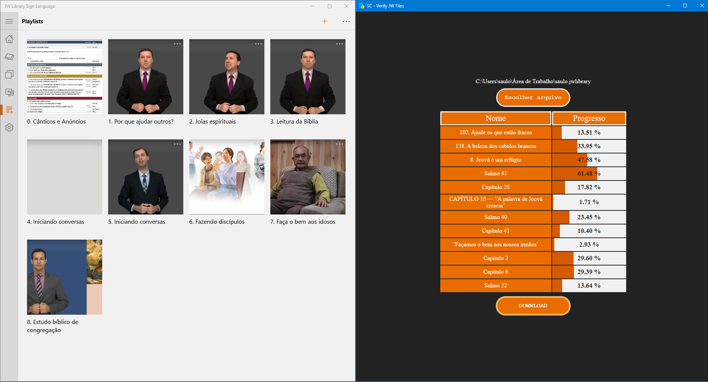

# SC - Verify JW Sign Language Files

> Para baixar as mídias de uma playlist do JW Sign Language

<div align="center">
   <!--  -->
   <!--  -->
   
   <!--  -->
   
   
   
   
</div>

---

<div align="center">
   
</div>

---

## Use

```sh
git clone https://github.com/saulotarsobc/sc-verifify-jw-files.git sc-verifify-jw-files;
cd sc-verifify-jw-files;
npm install;

# RUN
npm run dev;

# BUILD
npm run dist;
```
